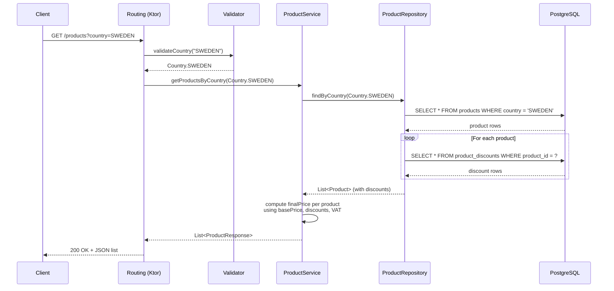
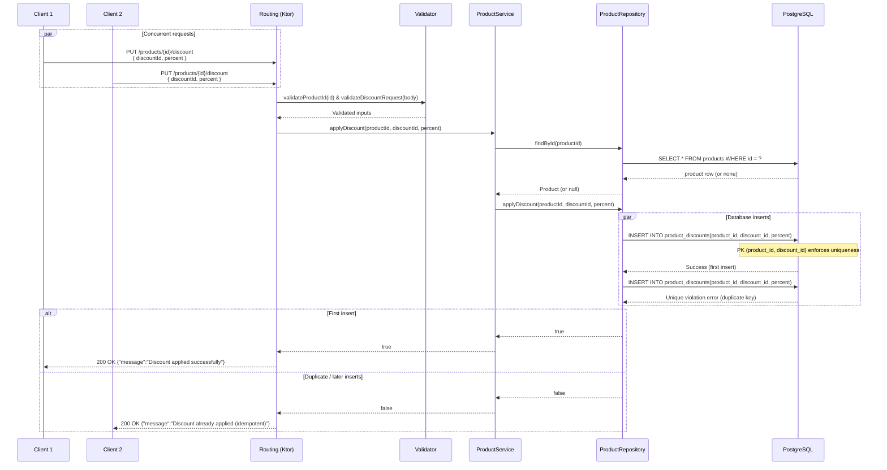

## Architecture Documentation

### Overview

This service is a small Ktor application that exposes a Product API backed by PostgreSQL.  
The main responsibilities are:

- **Store products** with a base price and a country (which determines VAT).
- **Apply discounts** to products, with guarantees that the same discount is never applied twice to the same product.
- **Expose read APIs** that return products with the final price calculated using VAT and all applied discounts.

The overall shape is:

- **HTTP layer**: Ktor routes (`/products`, `/products/{id}/discount`).
- **Service layer**: `ProductService` contains business logic (price calculation, orchestration).
- **Repository layer**: `ProductRepository` handles all database interaction using Exposed.
- **Database**: PostgreSQL with two tables: `products` and `product_discounts`.

---

## Data Model & Flow

### Tables

- **`products`**
    - `id` (PK, `VARCHAR`)
    - `name` (`VARCHAR`)
    - `base_price` (`DECIMAL`)
    - `country` (`VARCHAR`, stores the enum name)

- **`product_discounts`**
    - `product_id` (`VARCHAR`, FK → `products.id`)
    - `discount_id` (`VARCHAR`)
    - `percent` (`DECIMAL`)
    - **Primary key**: (`product_id`, `discount_id`)

### Layers

- **Routing**
    - Parses HTTP requests.
    - Delegates input validation to a validator.
    - Calls `ProductService` methods and returns JSON responses.

- **Service**
    - `getProductsByCountry(country: Country)`:
        - Fetches products from the repository.
        - For each product, calculates the final price:
          \[
          finalPrice = basePrice * (1 - totalDiscount%) * (1 + VAT\%)
          \]
    - `createProduct(request: ProductCreationRequest)`:
        - Creates a `Product` with a generated UUID.
        - Persists it via `ProductRepository`.
    - `applyDiscount(productId, discountId, percent)`:
        - Ensures the product exists.
        - Delegates discount application to the repository.
        - Returns **true** if a new row was inserted, **false** if the discount was already there.

- **Repository**
    - Uses Exposed to talk to PostgreSQL.
    - `findByCountry(country)` returns `List<Product>` with their associated discounts.
    - `save(product)` inserts into `products`.
    - `applyDiscount(productId, discountId, percent)` inserts into `product_discounts` and relies on the primary key constraint for idempotency.

---

## Concurrency & Idempotency Approach

### The Problem

We need to guarantee:

> “The same discount cannot be applied more than once to the same product.”

Multiple clients may send `PUT /products/{id}/discount` with the **same** `discountId` at roughly the same time.

### The Chosen Solution: Database-Level Concurrency Control

The core idea is to let **PostgreSQL** enforce uniqueness:

- The `product_discounts` table has a **composite primary key** on `(product_id, discount_id)`.
- When two concurrent requests try to insert the same `(product_id, discount_id)` pair:
    - The first one succeeds.
    - The second one hits a **unique constraint violation**.

In the repository:

- We attempt a normal insert into `product_discounts`.
- If the insert succeeds: we return `true` (discount was newly applied).
- If the database reports a **unique constraint violation**:
    - We interpret this as “the discount was already present”.
    - We return `false` and treat the operation as **idempotent**.

This has a few nice properties:

- **No application-level locks**: no explicit mutexes or distributed locks are needed.
- **Works across instances**: any number of app instances can share the same database and still enforce the invariant.
- **Strong guarantees**: the database is the single source of truth for “has this (product, discount) pair been stored?”.

---

## Sequence Diagrams

### GET /products?country={country}

This endpoint returns all products for a given country, with their discounts and final prices computed on the fly.

---

### PUT /products/{id}/discount

This endpoint applies a discount to a product.  
Key behavior:

- First call for a given `(productId, discountId)`:
    - Discount row is inserted.
    - Response: `"Discount applied successfully"`.
- Subsequent calls with same IDs (even concurrently):
    - Database rejects the duplicate due to the primary key.
    - Service treats it as **already applied**.
    - Response: `"Discount already applied (idempotent)"`.

---

## Summary

- The service is intentionally small and layered: **Routing → Service → Repository → PostgreSQL**.
- All critical invariants around discounts are enforced at the **database level**, not with in-memory locks.
- The concurrency story is simple but robust: **composite primary key** + **graceful handling** of unique constraint violations give us idempotent behavior even under high contention.